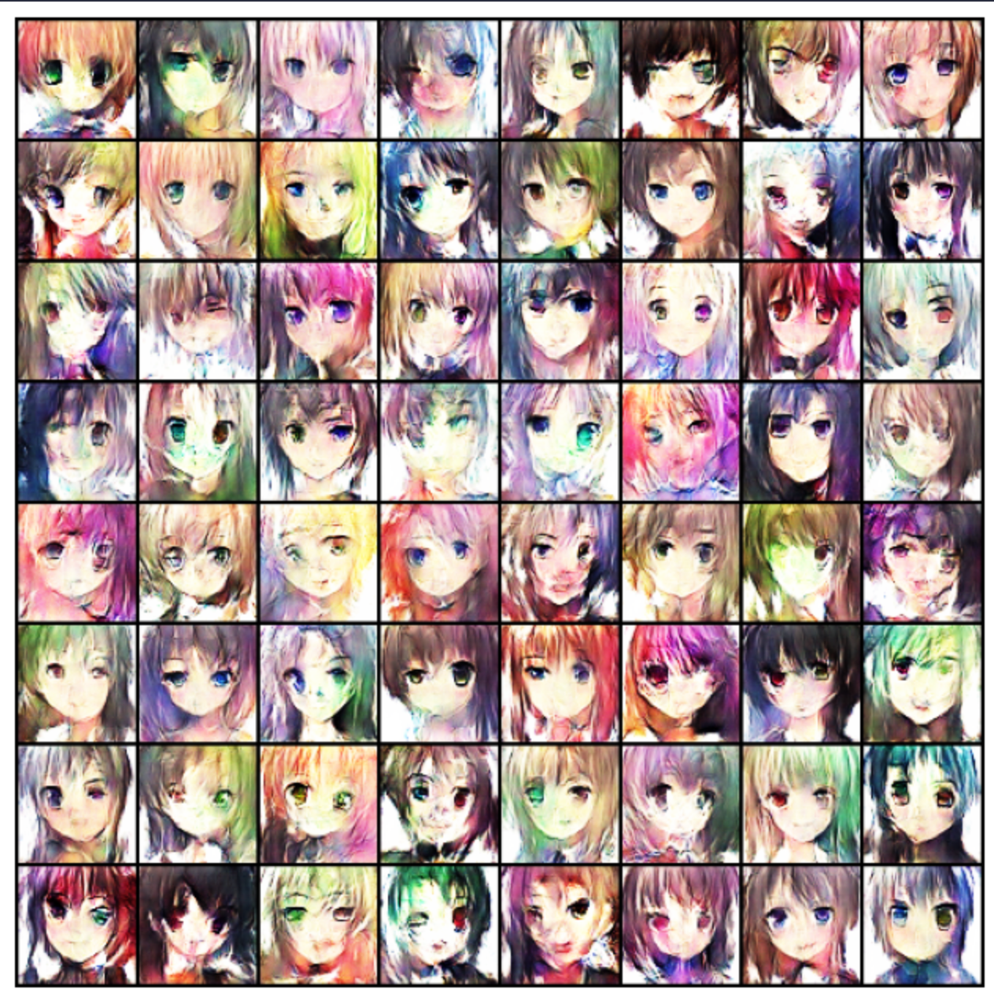
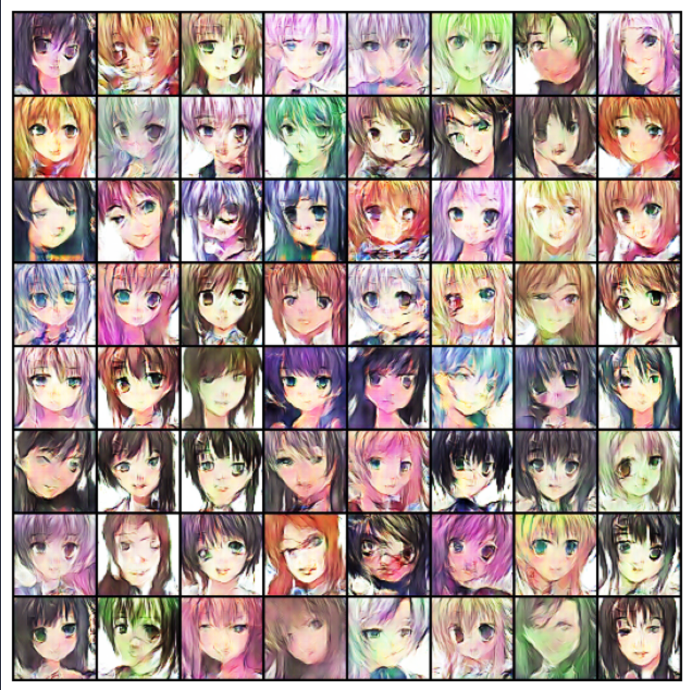

# DCGAN and WGAN implementation using PyTorch

---

This project was designed as a part of the Research Practice at the South China University of Technology. The main focus was to better understand the architecture of the **Generative Adversarial Networks**. The repository contains implementations of DCGAN and WGAN. 

- A **DCGAN**, or Deep Convolutional Generative Adversarial Network, is a type of generative adversarial network (GAN) architecture that uses deep convolutional neural networks (CNNs) for both the generator and discriminator networks. DCGANs are commonly used for unsupervised learning and are particularly effective at generating high-quality images.
- A **WGAN**, or Wasserstein Generative Adversarial Network, is a variation of the standard Generative Adversarial Network (GAN) that incorporates the Wasserstein distance (also known as the Earth-Mover's distance) as a loss function to improve the stability and convergence properties of the model during training.

---

The DCGAN was implemented first thanks to the tutorial from the official PyTorch documentation. 

https://pytorch.org/tutorials/beginner/dcgan_faces_tutorial.html

There were some additions made to this project that include *data augmentation and adjusting learning rate over time.* Different learning rates and batch sizes were used to achieve the best performance possible with this architecture and hardware.

---

The WGAN was built on top of the DCGAN and changes the loss function calculation during the training process. The presented WGAN implementation also includes weight clipping to make it more stable.

---

At the end of the experiment it was found out that it generally requires less training epochs for DCGAN to generate appropriate images, whereas it requires more epochs for WGAN to get close to the image quality of the DCGAN. This is mostly related to the fact that generator is not updated on every iteration in WGAN, so although it might require more epochs, but the computational time is close to the DCGAN.

---

**WGAN Results 15 epochs**

---

**DCGAN Results 10 epochs**
